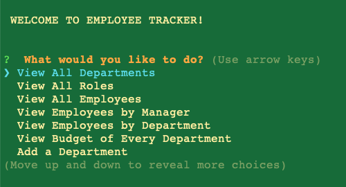
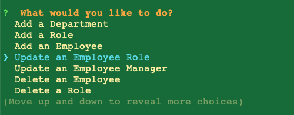
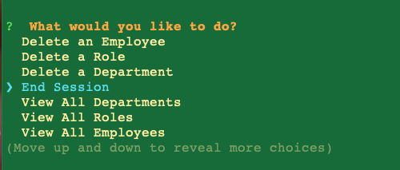
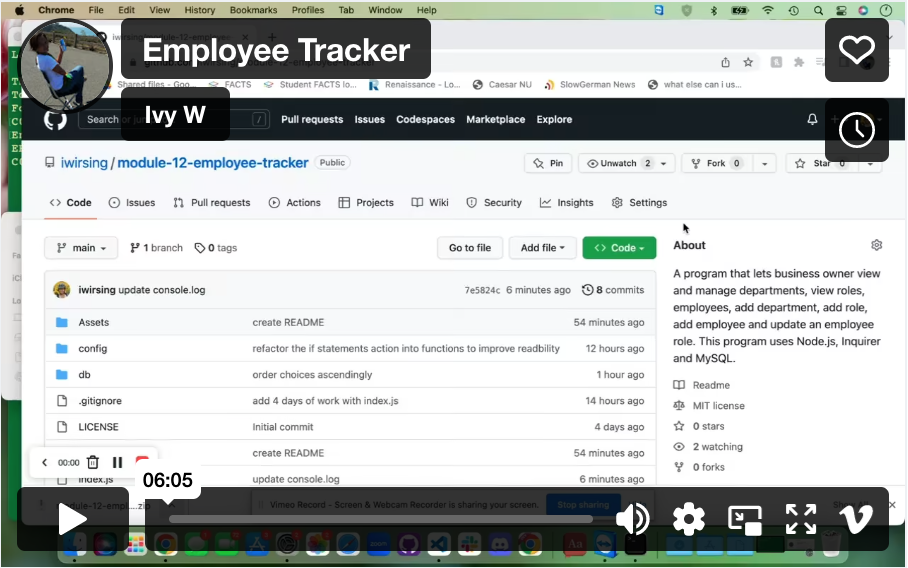

# Module 12: Employee Tracker

##  Description:

A program that lets business owners view all departments, view all roles, view all employees, view the budget of each department based on the actual employees, add department, add role, add employee , update an employee's role and manager, and delete department,role and employee. This program uses Node.js, Inquirer and MySQL.

##  Table of Contents 
1. [Installation](#installation)
2. [Usage](#usage) 
3. [Contributing](#contributing) 
4. [Screenshots](#screenshots)
5. [Walkthrough Video](#walkthrough-video)
6. [Test](#test) 
7. [Questions](#questions)
8. [License](#license)
9. [Sources](#sources)

## Installation 

1. Download the folder to the local computer. 
2. Open the folder in the terminal. 
3. Run `npm i` to install the dependencies. 
4. Change the mysql password that would work in the local computer when necessary. 
5. Finally run `node index.js` to to run the program.

## Usage 

After running the `node index.js` in the terminal. Explore the program's options which are: 
1. View All Departments 
2. View All Roles 
3. View All Employees
4. View Budget of Every Department
5. Add a Department
6. Add a Role
7. Add an Employee
8. Update an Employee Role
9. Update an Employee Manager
10. Delete an Employee
11. Delete a Role
12. Delete a Department
13. End Session

## Contributing 

Download and change the program accordingly in one's local computer. Do inform the owner  for the updates before committing into this repository.

## Screenshots
First seven options:

The rest of the options:

## Walkthrough Video

## Test 

Run the program using `node index.js` and go through each option and prompts. Check the response against the results of the database in the mysql environment.

## Questions? 

Please contact me through any of the following:

1. My [Github](https://github.com/iwirsing).
2. Email: <a href="mailto:ivymolina@gmail.com">ivymolina@gmail.com</a>

## License

The project in covered under the [MIT](https://opensource.org/licenses/MIT) license

## SOURCES
1. https://stackoverflow.com/questions/1435177/why-does-this-sql-code-give-error-1066-not-unique-table-alias-user
2. https://stackoverflow.com/questions/66626936/inquirer-js-populate-list-choices-from-sql-database
3. https://www.wikihow.com/Order-Alphabetically-in-SQL
4. https://www.npmjs.com/package/console.table
5. Tutor: Geronimo Perez
